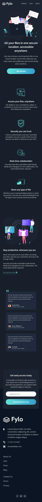
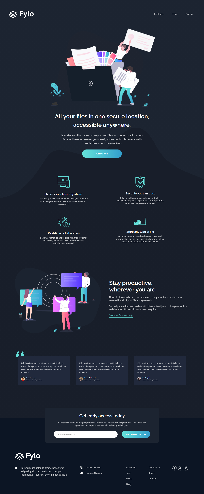

# Frontend Mentor - Fylo dark theme landing page solution

This is a solution to the [Fylo dark theme landing page challenge on Frontend Mentor](https://www.frontendmentor.io/challenges/fylo-dark-theme-landing-page-5ca5f2d21e82137ec91a50fd). Frontend Mentor challenges help you improve your coding skills by building realistic projects. 

## Table of contents

- [Overview](#overview)
  - [The challenge](#the-challenge)
  - [Screenshots](#screenshots)
  - [Links](#links)
- [My process](#my-process)
  - [Built with](#built-with)
  - [What I learned](#what-i-learned)
- [Author](#author)

## Overview

### The challenge

Users should be able to:

- View the optimal layout for the site depending on their device's screen size
- See hover states for all interactive elements on the page

### Screenshots

### Links

- Solution URL: [Smooth scroll](http://iamdustan.com/smoothscroll/)
- Solution URL: [Navigation hover](https://stackoverflow.com/questions/556153/inline-elements-shifting-when-made-bold-on-hover)
- Solution URL: [Email validation](https://www.w3resource.com/javascript/form/email-validation.php)
- Solution URL: [Background resizing](https://www.tutorialrepublic.com/faq/how-to-get-current-image-size-in-javascript.php)
- Solution URL: [Background resizing](https://plainjs.com/javascript/styles/get-the-position-of-an-element-relative-to-the-document-24/)
- Solution URL: [Button hover](https://github.com/Tiago138/fylo-dark-theme-landing-page/blob/main/scss/_globals.scss)

## My process

### Built with

- HTML
- SASS
- Flexbox
- JavaScript
- Mobile-first workflow

### What I learned

Things what i learned are in the links.

## Author

- Frontend Mentor - [@aVantaci](https://www.frontendmentor.io/profile/aVantaci)
